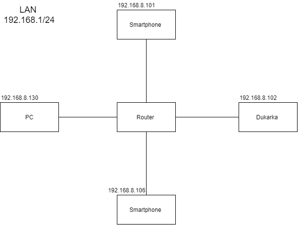

## System operacyjny w środowisku sieciowym

### Zadania


1. Z wykorzystaniem maszyny wirtualnej, zainstaluj SO oraz wypisz parametry konfiguracji IP tj:
   * Adres
   * Maska
   * Adres bramy
   * DNS 1
   * DNS 2
    
    Powyższe parametry uzyskaj na wszystkich z wymienionych systemów

   * [Linux Alpine](https://alpinelinux.org/)
   * [Linux Debian](https://www.debian.org/)
   * [Linux CentOS](https://www.centos.org/)
   * Windows 

2. Sprawdź oraz przygotuj charakterystykę dla przykładowego urządzenia w Twojej sieci domowej
   * Adres
   * Maska
   * Adres bramy
   * DNS 1
   * DNS 2
  
    Przygotuj dokumentację graficzną Twojej sieci domowej, uwzględnij adresy i urządzenia

3. Zarejestruj konto w CISCO Academy celem pobrania Packet tracer
   https://www.netacad.com/courses/packet-tracer

4. Dlaczego umiejętnosci z zakresu sieci komputerowych mogą mi się przydać? :)


### Charakterystyka systemu operacyjnego

| Charakterystyka           | wartość               | komentarzu                |
| -------------             |:-------------:        | -----:                    |
| nazwa                     | linux                 | centos 7                  |
| cfg interfejsów           | centos 7 | /etc/sysconfig/network-scripts         |
| program (parametry sieci) | niewiem               |                           |
| Nazwa                     | Alpine Linux              |                           |
| Parametry IP              | $ ip all              |show all eth interfaces (ip configuration)  |
| routing table             | $ ip route show       | what is gateway?! default jest gatewayem  |
| DNS config                | $ cat /etc/resolv.conf| which DNS  were set                   |

### Konfiguracja połączenia sieciowego 

| Parametr      | wartość       | komentarzu |
| ------------- |:-------------:| -----:|
| Adres IP      | 10.0.2.15     | przydzielony przez DHCP |
| Maska podsieci| 10.0.2.15/24  | Notacja cidr 255.255.255.0 | 
| Brama         | 10.0.2.2      | default from route table|
| DNS 1         | 10.10.4.204     | cat /etc/resolv.conf |
| DNS 2         | 1.1.1.1      | nslookup uek.krakow.pl |


## Charakterystyka mojego komputera w sieci domowej

| Parametr      | wartość       | komentarzu |
| ------------- |:-------------:| -----:|
| Adres IP      | 192.168.8.130  | ipconfig |
| Maska podsieci| 225.225.255.0 | ipconfig | 
| Brama         | 192.168.8.1   | ipconfig |
| DNS 1         | 192.168.8.1    | ipconfig /all |


### Schemat sieci



aby załączyć obrazek 

```markdown


```


Nauka sieci komputerowych może mi się przydać do lepszego zarządzania własną siecią domową, rozwiązywania problemów z nią związanych oraz głębszego zrozumienia działania internetu oraz połączenia między komputerem a serwerem.

